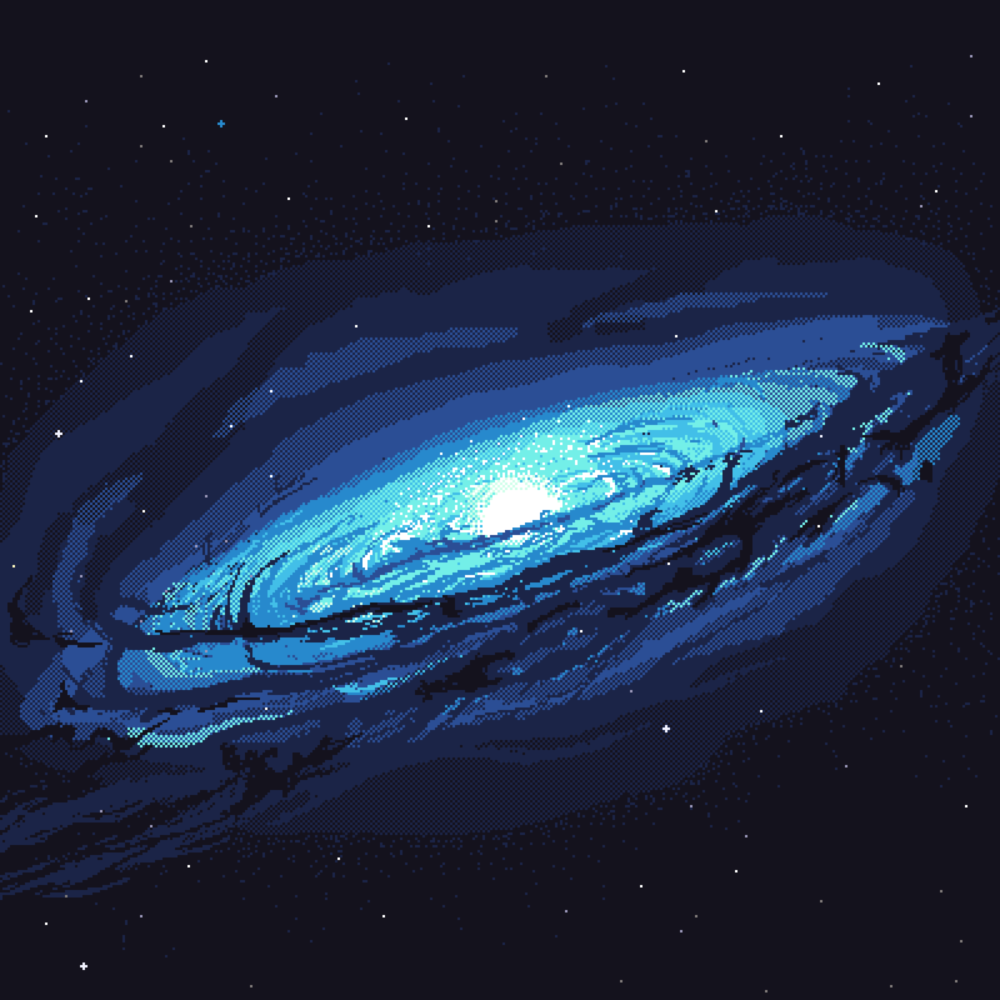

## 🌌 Marcos Alves: Debugando o Universo, Codificando a Vida!

 


- 💻 Cursando Desenvolvimento de Software Multiplataforma.
- 📓 Técnico em Informática para Internet
- 📧 E-mail: [marcos.a.lopes7701@gmail.com](mailto:marcos.a.lopes7701@gmail.com)
- 📚 Livro Favorito: "O Homem que Caiu na Terra" por Walter Tevis.

##

<a href="https://github.com/MarcosAlves90">
  
</a>

```lua
-- Inicia o processo de criação do universo.
-- Retorna uma representação simbólica do universo.
function bigBang()
    -- Simula a criação do universo
    return '🌌' -- Representa o universo
end
```

```lua
-- Função principal para criar um novo universo.
-- Utiliza a função bigBang para iniciar a criação.
function criarUniverso()
    return bigBang()
end
```

<div align="center"><br>
  <a href="https://github.com/MarcosAlves90">
    
  </a>
</div>

##

<div align="center">
  <a href="mailto:marcos.a.lopes7701@gmail.com" target="_blank"> </img></a>
  <a href="https://www.instagram.com/marcos.pilgrim" target="_blank"> </img></a>
  <a href="https://www.linkedin.com/in/marcosalveslopesjunior" target="_blank"> </img></a>
</div>

<picture>
  <source media="(prefers-color-scheme: dark)" srcset="https://raw.githubusercontent.com/MarcosAlves90/MarcosAlves90/output/github-contribution-grid-snake-dark.svg">
  
</picture>
