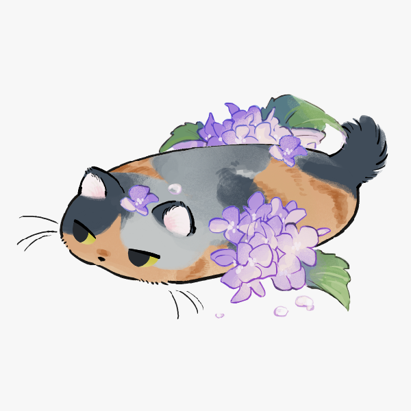

## 📌 Marcos Alves ao seu dispor! 

- 📖 Estudando Desenvolvimento de Software Multiplataforma e Design Gráfico.
- 📒 Técnico em Informática para Internet.
- 📧 E-mail: MarcosAlves25@proton.me
- 🪐 Fato curioso: Sou extremamente criativo.

##

<!-- ./STAT -->

  
   
 
  

   

 
  
  

##

  <a href="https://twitter.com/yellowpinguim" target="_blank"> </img></a>
  <a href="mailto:MarcosAlves25@proton.me" target="_blank"> </img></a>
  <a href="https://www.linkedin.com/in/marcosalveslopesjunior" target="_blank"> </img></a>

<picture>
  <source media="(prefers-color-scheme: dark)" srcset="https://raw.githubusercontent.com/MarcosAlves90/MarcosAlves90/output/github-contribution-grid-snake-dark.svg">
  
</picture>
